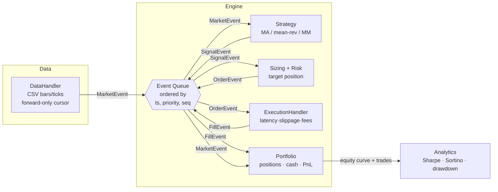

# QuantForge

**Event-driven backtesting & trading simulator** with a C++20 core and Python
bindings. QuantForge runs strategies through a single, strictly time-ordered
event queue — the same architecture a live trading system uses — so a backtest
and a paper-trading run share one code path and the same no-lookahead guarantee.

- **C++20 core**: event loop, policy-based execution models, portfolio
  accounting, and analytics.
- **Python bindings** (pybind11 + scikit-build-core): drive strategies from a
  notebook, get results back as NumPy arrays.
- **Deterministic**: a fixed seed reproduces a run bit-for-bit, and parameter
  sweeps give identical results at any thread count.

> Research tool, not investment advice. See [Limitations](#limitations).

---

## Features

- Event-driven engine with a single time-ordered queue
  (`MarketEvent → SignalEvent → OrderEvent → FillEvent`).
- Streaming `DataHandler` that is **no-lookahead by construction**.
- Three built-in strategies plus a clean `Strategy` base for your own.
- **Policy-based** execution: mix any latency × slippage × fee model.
- Portfolio with average-cost accounting, realized/unrealized PnL, and risk
  limits.
- Analytics: Sharpe, Sortino, max drawdown, annualized volatility, turnover,
  hit rate, equity-curve export.
- Multithreaded parameter sweeps that are **deterministic regardless of thread
  count**.
- GoogleTest suite (66 tests), micro + full-pipeline benchmarks, and CI with
  sanitizers and clang-format/clang-tidy.

---

## Architecture

Every component communicates only through events on one priority queue. At a
given timestamp, events are processed in the fixed logical order
`Market < Signal < Order < Fill`, so a strategy always observes market data
*before* it can act on it — lookahead is structurally impossible.



**Event ordering key** `(timestamp, priority, sequence)`:

1. `timestamp` — the simulation clock never moves backward on pop;
2. `priority` — `Market < Signal < Order < Fill` at the same instant;
3. `sequence` — a FIFO insertion counter makes the order total and reproducible.

---

## Project layout

```
quantforge/
├── include/quantforge/   # public headers (header-only pieces live here)
│   ├── event.hpp, event_queue.hpp, types.hpp, symbol_table.hpp
│   ├── data_handler.hpp, strategy.hpp, strategies.hpp, rolling.hpp
│   ├── execution_models.hpp, execution_handler.hpp
│   ├── portfolio.hpp, analytics.hpp
│   └── engine.hpp, thread_pool.hpp, sweep.hpp
├── src/                  # core library (quantforge_core)
├── python/               # pybind11 bindings + quantforge package
├── tests/                # GoogleTest suite
├── benchmarks/           # events/sec micro + full-pipeline benchmarks
├── examples/             # Jupyter notebook + sample data
├── scripts/              # sample-data generator / downloader
├── cmake/                # FetchContent dependency helpers
└── .github/workflows/    # CI
```

---

## Build (C++)

Requires CMake ≥ 3.20, a C++20 compiler (GCC 11+, Clang 14+, or MSVC 2022),
and Ninja (recommended). Dependencies (GoogleTest, pybind11) are fetched
automatically.

```bash
cmake -S . -B build -G Ninja -DCMAKE_BUILD_TYPE=Release
cmake --build build
ctest --test-dir build --output-on-failure
```

Run the benchmarks:

```bash
./build/bin/bench_engine 1000000
./build/bin/bench_event_queue 1000000
```

Useful CMake options: `-DQF_BUILD_TESTS=ON/OFF`, `-DQF_BUILD_BENCHMARKS=ON/OFF`,
`-DQF_BUILD_PYTHON=ON/OFF`, `-DQF_ENABLE_SANITIZERS=ON` (ASan+UBSan, Debug).

## Install (Python)

```bash
pip install .            # builds the C++ module via scikit-build-core
# or, with the notebook extras:
pip install ".[notebook]"
```

On a machine without MSVC, point the build at GCC/Ninja first:

```bash
export CMAKE_GENERATOR=Ninja CC=gcc CXX=g++   # PowerShell: $env:CC="gcc" etc.
pip install .
```

---

## Quickstart

### Python

```python
import numpy as np
import quantforge as qf

n = 300
ts = (np.arange(n) * 86_400_000_000_000).astype(np.int64)  # daily, nanoseconds
close = 100 + np.cumsum(np.random.default_rng(0).normal(0, 1, n))
bars = {"ts": ts, "open": close, "high": close + 1, "low": close - 1,
        "close": close, "volume": np.full(n, 1e6)}

res = qf.run_backtest(
    bars,
    strategy="ma_crossover",
    strategy_params={"fast": 20, "slow": 60},
    slippage={"kind": "fixed_bps", "bps": 1.0},
    fee={"kind": "per_share", "fee": 0.005},
    seed=7,
)

print(res["report"]["sharpe"], res["final_equity"])
# res["equity"] / res["equity_ts"] are NumPy arrays ready to plot.
```

A pandas DataFrame with `open/high/low/close/volume` (and a `ts` column or a
DatetimeIndex) works directly in place of the dict. See
[`examples/quantforge_demo.ipynb`](examples/quantforge_demo.ipynb) for a full
run with an equity-curve plot and a parameter sweep.

### C++

```cpp
#include "quantforge/engine.hpp"
#include "quantforge/strategies.hpp"
#include "quantforge/execution_models.hpp"
// ... load bars into a CsvBarDataHandler, build an ExecutionHandler,
// then:
qf::Engine engine(data, strategy, std::move(exec), cfg);
qf::BacktestResult r = engine.run();
```

---

## Strategies

| Name              | Idea                                                  | Key params                          |
|-------------------|-------------------------------------------------------|-------------------------------------|
| `ma_crossover`    | Trade fast/slow moving-average crosses                | `fast`, `slow`                      |
| `mean_reversion`  | Z-score reversion: fade moves away from a rolling mean| `lookback`, `entry_z`, `exit_z`     |
| `market_maker`    | Inventory-aware lean around a rolling fair value      | `fair_lookback`, `band`, `max_inventory` |

Implement `qf::Strategy` (one `onMarket` method) for your own; strategies emit
signals through a context and never touch the portfolio or future data.

## Cost models

Compose any one from each column into the `ExecutionHandler`:

| Latency                 | Slippage                                      | Fees                     |
|-------------------------|-----------------------------------------------|--------------------------|
| `fixed` (constant ns)   | `fixed_bps` (constant bps)                    | `per_share` (per unit)   |
| `random` (uniform ns)   | `volume` (√ market impact vs participation)   | `bps` (of notional)      |
|                         | `random_bps` (uniform adverse bps)            |                          |

Partial fills are capped at `max_participation × available volume`; limit
orders fill only when marketable against the reference price.

---

## Benchmarks

Measured on the development machine (Windows, GCC 16.2.0, `-O2` Release,
single run of 1,000,000 events). **These are illustrative — absolute numbers
vary by CPU, compiler, and build type.** Reproduce with the commands above.

| Benchmark                               | Throughput (measured)   | Notes                                             |
|-----------------------------------------|-------------------------|---------------------------------------------------|
| Full backtest pipeline (`bench_engine`) | ~14 M bars/sec          | MA(20,60) + 1 bp slippage + per-share fee, 1 M bars |
| Event queue stress (`bench_event_queue`)| ~1.1 M events/sec       | 1 M events pushed in random timestamp order       |

The full pipeline is faster per event than the queue stress test because a real
backtest holds only a handful of events in the queue at once (bars arrive in
order), whereas the stress test deliberately enqueues all events at once in
random order to force heap work.

---

## Testing & CI

- 66 GoogleTest cases covering event ordering, the no-lookahead guarantee,
  known-answer PnL (hand-derived and cross-checked), cost models, analytics
  (cross-checked in Python), and determinism across repeat runs and thread
  counts.
- CI (GitHub Actions) builds and tests with GCC and Clang, runs the suite under
  **AddressSanitizer + UndefinedBehaviorSanitizer**, enforces **clang-format**,
  runs **clang-tidy**, and builds + smoke-tests the Python wheel.

```bash
ctest --test-dir build --output-on-failure           # all tests
./build/bin/quantforge_tests --gtest_filter='KnownAnswer.*'
```

---

## Design tradeoffs

- **`double` prices, not fixed-point.** Fast and interoperable with NumPy/pandas,
  at the cost of exact tick arithmetic. A production matching engine would use
  integer ticks; this is a research backtester.
- **One event queue, single-threaded per backtest.** Parallelism comes from
  running many independent backtests across a thread pool, not from
  parallelizing one. This keeps each run simple, correct, and deterministic.
- **Runtime polymorphism for cost models.** `unique_ptr` policies let Python
  pick models at runtime and keep the hot path readable; a templated
  policy-based design would shave virtual calls but lose that flexibility.
- **Simplified execution.** Fills price against the current bar/tick with
  configurable slippage and partial fills; there is no full limit-order book or
  queue-position model (that lives in the companion MatchCore project).
- **Determinism over wall-clock speed in sweeps.** Results are written to a
  fixed index and seeds come from config, never from thread id or the clock, so
  output never depends on scheduling.

## Limitations

- No full limit-order-book simulation or queue-position modeling.
- Single-asset sizing in the bundled strategies; the engine tracks multiple
  symbols but the example sizers target one instrument.
- Costs are modeled, not calibrated — slippage/latency/fee parameters are inputs,
  not fitted to a venue.
- Corporate actions, dividends, borrow costs, and financing are not modeled.
- Synthetic sample data ships for reproducibility; real-data quality (gaps,
  splits, survivorship) is the user's responsibility.
- Results are for research and education only and are not investment advice.

## License

MIT — see [LICENSE](LICENSE).
