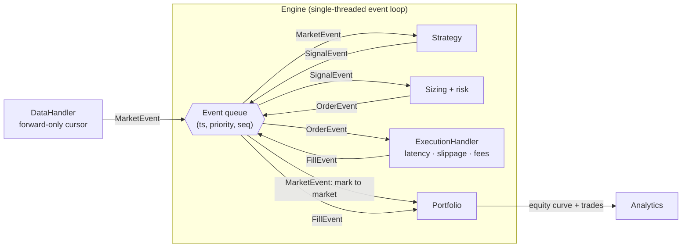
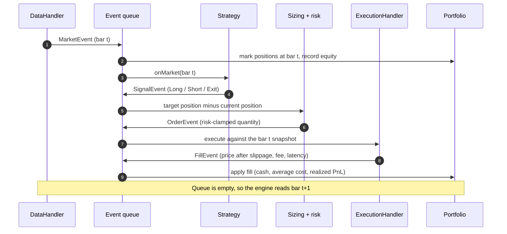
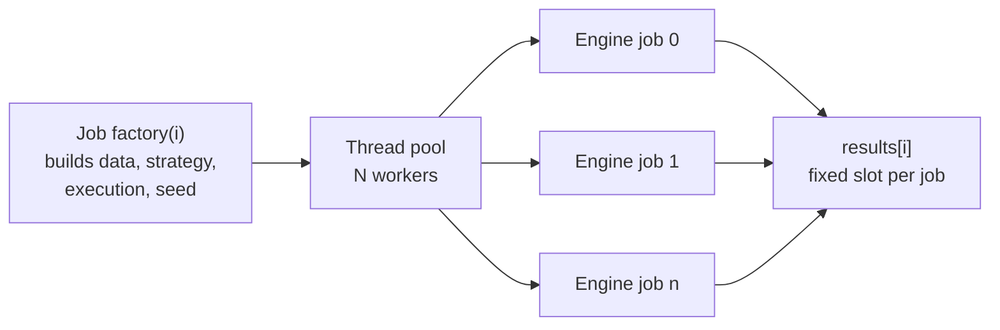

<div align="center">

# QuantForge

**An event-driven backtesting and trading simulator with a C++20 core and Python bindings.**

[](https://github.com/yadavchandan84/QuantForge/actions/workflows/ci.yml)


</div>

QuantForge simulates trading the way a live system runs: every piece of data, decision, order,
and fill is an event on one time-ordered queue. Because the queue decides what each component
can see and when, lookahead is ruled out by the structure of the engine, not by discipline.

The core is C++20. A pybind11 module exposes it to Python, so you can run a backtest from a
notebook and get the results back as NumPy arrays.

```python
import quantforge as qf

res = qf.run_backtest(bars, "ma_crossover", {"fast": 20, "slow": 60}, seed=7)
res["report"]["sharpe"], res["equity"]   # metrics dict, NumPy equity curve
```

---

## Contents

- [Highlights](#highlights)
- [Architecture](#architecture)
- [Quickstart](#quickstart)
- [Build and install](#build-and-install)
- [Reference](#reference)
- [Benchmarks](#benchmarks)
- [Testing and CI](#testing-and-ci)
- [Project layout](#project-layout)
- [Design tradeoffs](#design-tradeoffs)
- [Limitations](#limitations)
- [Roadmap](#roadmap)
- [License](#license)

---

## Highlights

| Area | What you get |
|---|---|
| **Engine** | One priority queue ordered by `(timestamp, priority, sequence)` carries `Market`, `Signal`, `Order`, and `Fill` events |
| **No lookahead** | A forward-only data cursor plus fixed event priority: a strategy can never observe data it wouldn't have had live |
| **Execution** | Plug-in latency, slippage, and fee models, with partial fills capped by available volume |
| **Portfolio** | Average-cost accounting, realized and unrealized PnL, position and gross-exposure limits |
| **Analytics** | Sharpe, Sortino, max drawdown, annualized volatility, turnover, hit rate, equity-curve CSV export |
| **Sweeps** | A thread pool runs many backtests; results are bit-identical at any thread count |
| **Replay** | One seeded RNG stream, so the same seed reproduces a run exactly |
| **Python** | `pip install .` builds the module; inputs are pandas or NumPy, outputs are NumPy arrays |

---

## Architecture

### Component view

Components never call each other directly. Each one reads events from the queue and writes new
events back to it. The engine is the only thing that pops from the queue and routes events.



| Component | Header | Responsibility |
|---|---|---|
| Event types | `event.hpp` | `MarketEvent` (bar, tick, or L1 quote), `SignalEvent`, `OrderEvent`, `FillEvent` in one `std::variant` |
| Event queue | `event_queue.hpp` | Min-heap ordered by `(timestamp, priority, sequence)` |
| DataHandler | `data_handler.hpp` | Loads CSV bars, validates time order, exposes only `next()` |
| Strategy | `strategy.hpp`, `strategies.hpp` | Reacts to market events and emits signals through a narrow context |
| Sizing + risk | `engine.cpp`, `portfolio.hpp` | Turns a signal into a target position, orders the difference, clamps to risk limits |
| ExecutionHandler | `execution_handler.hpp`, `execution_models.hpp` | Prices an order with latency, slippage, fees, and partial fills |
| Portfolio | `portfolio.hpp` | Cash, positions, average cost, realized and unrealized PnL |
| Analytics | `analytics.hpp` | Performance metrics computed from the equity curve and trade log |
| Sweeps | `thread_pool.hpp`, `sweep.hpp` | Runs independent backtests in parallel with deterministic output |

### Lifecycle of one bar

The engine reads one bar, then drains the queue completely before reading the next. Each step
below is a separate event, which is why the order of operations is always the same.



### Why lookahead is impossible

Two mechanisms work together:

1. **The data source only moves forward.** `DataHandler` exposes `next()`, `finished()`, and
   `reset()`. There is no indexing, peeking, or random access, so future rows are unreachable.
   Loading fails if timestamps go backward.
2. **Event priority fixes the causal order.** When several events share a timestamp, they are
   popped in this order:

   | Priority | Event | Meaning |
   |:---:|---|---|
   | 0 | `MarketEvent` | New data becomes visible |
   | 1 | `SignalEvent` | A strategy reacts to what it has seen |
   | 2 | `OrderEvent` | The signal becomes a sized order |
   | 3 | `FillEvent` | The order executes |

   A monotonically increasing sequence number breaks any remaining tie, so the ordering is total
   and every run processes events identically.

Both guarantees have dedicated tests: `DataHandler.NoLookaheadByConstruction` and
`KnownAnswer.EngineNeverLeaksFuturePrices`.

### Determinism and parallel sweeps



- **Nothing is shared between jobs.** Each job owns its own data handler, strategy, execution
  handler, and portfolio.
- **Seeds come from configuration**, never from the clock or a thread id.
- **One RNG stream per run.** Random slippage is drawn before random latency on every fill, in a
  fixed order.
- **Results go into fixed slots.** Job `i` always writes `results[i]`, so the output doesn't
  depend on which thread finished first.

`Sweep.DeterministicAcrossThreadCounts` and `Determinism.SweepWithRandomnessIdenticalAcrossThreads`
compare full equity paths across 1, 2, 3, 4, and 8 threads and require exact equality.

---

## Quickstart

### Python

```python
import numpy as np
import quantforge as qf

n = 300
ts = (np.arange(n) * 86_400_000_000_000).astype(np.int64)   # daily bars, in nanoseconds
close = 100 + np.cumsum(np.random.default_rng(0).normal(0, 1, n))
bars = {"ts": ts, "open": close, "high": close + 1, "low": close - 1,
        "close": close, "volume": np.full(n, 1e6)}

res = qf.run_backtest(
    bars,
    strategy="ma_crossover",
    strategy_params={"fast": 20, "slow": 60},
    slippage={"kind": "fixed_bps", "bps": 1.0},
    fee={"kind": "per_share", "fee": 0.005},
    initial_cash=100_000.0,
    seed=7,
)

print(f"Sharpe {res['report']['sharpe']:.2f}, final equity {res['final_equity']:,.2f}")
```

A pandas DataFrame with `open`, `high`, `low`, `close`, `volume` columns (plus a `ts` column or a
`DatetimeIndex`) can be passed instead of the dict.

The notebook [`examples/quantforge_demo.ipynb`](examples/quantforge_demo.ipynb) walks through a full
run: loading data, the metrics report, an equity curve with a drawdown panel, a parameter grid,
and a reproducibility check.

### C++

This example compiles as written against the library:

```cpp
#include <cstdio>
#include <memory>

#include "quantforge/data_handler.hpp"
#include "quantforge/engine.hpp"
#include "quantforge/execution_models.hpp"
#include "quantforge/strategies.hpp"

int main() {
    qf::SymbolTable symbols;
    qf::CsvBarDataHandler data("examples/data/synth_daily.csv", "SYNTH", symbols);

    qf::MovingAverageCrossover strategy(symbols.lookup("SYNTH"), /*fast=*/20, /*slow=*/60);

    qf::ExecutionHandler exec(std::make_unique<qf::FixedLatency>(0),
                              std::make_unique<qf::FixedBpsSlippage>(1.0),
                              std::make_unique<qf::PerShareFee>(0.005));

    qf::BacktestConfig cfg;
    cfg.initial_cash = 100'000.0;
    cfg.target_position = 100.0;
    cfg.seed = 7;

    qf::Engine engine(data, strategy, std::move(exec), cfg);
    const qf::BacktestResult r = engine.run();

    std::printf("final equity %.2f | sharpe %.3f | max dd %.2f%% | fills %zu\n",
                r.final_equity, r.report.sharpe, r.report.max_drawdown * 100.0, r.num_fills);
    qf::writeEquityCurveCsv("equity_curve.csv", r.equity_curve);
}
```

Run on the bundled 750-bar sample, this prints:

```
final equity 100941.17 | sharpe 0.171 | max dd 3.23% | fills 13
```

### Writing your own strategy (C++)

Subclass `qf::Strategy` and implement `onMarket`. The context only lets you emit signals. You
can't reach the portfolio, the queue, or future data.

```cpp
class BuyTheDip final : public qf::Strategy {
  public:
    explicit BuyTheDip(qf::SymbolId sym) : sym_(sym), window_(20) {}

    void onMarket(const qf::MarketEvent& ev, const qf::StrategyContext& ctx) override {
        if (ev.symbol != sym_) return;
        window_.push(ev.close);
        if (!window_.full()) return;
        if (ev.close < 0.97 * window_.mean()) ctx.emitSignal(sym_, qf::SignalDirection::Long);
        if (ev.close > window_.mean())        ctx.emitSignal(sym_, qf::SignalDirection::Exit);
    }
    void reset() override { window_.clear(); }
    std::string name() const override { return "BuyTheDip"; }

  private:
    qf::SymbolId sym_;
    qf::RollingWindow window_;   // O(1) rolling mean and standard deviation
};
```

---

## Build and install

**Requirements:** CMake 3.20 or newer, a C++20 compiler (GCC 11+, Clang 14+, or MSVC 2022), and
Ninja (recommended). GoogleTest and pybind11 are downloaded automatically with `FetchContent`.

```bash
git clone https://github.com/yadavchandan84/QuantForge.git
cd QuantForge
```

### One-command check (Windows)

[`scripts/run_all.ps1`](scripts/run_all.ps1) builds everything, runs the tests and benchmarks,
installs the Python package if needed, runs [`examples/demo.py`](examples/demo.py), and prints a
PASS/FAIL summary:

```powershell
powershell -ExecutionPolicy Bypass -File scripts\run_all.ps1
```

### C++ library, tests, and benchmarks

```bash
cmake -S . -B build -G Ninja -DCMAKE_BUILD_TYPE=Release
cmake --build build
ctest --test-dir build --output-on-failure

./build/bin/bench_engine 1000000
./build/bin/bench_event_queue 1000000
```

| CMake option | Default | Effect |
|---|:---:|---|
| `QF_BUILD_TESTS` | `ON` | Build the GoogleTest suite |
| `QF_BUILD_BENCHMARKS` | `ON` | Build the benchmarks |
| `QF_BUILD_PYTHON` | `OFF` | Build the pybind11 module |
| `QF_ENABLE_SANITIZERS` | `OFF` | AddressSanitizer + UndefinedBehaviorSanitizer (non-MSVC) |
| `QF_ENABLE_WARNINGS` | `ON` | `-Wall -Wextra -Wpedantic -Wshadow -Wconversion -Wsign-conversion` |

### Python package

```bash
pip install .                 # builds the C++ extension with scikit-build-core
pip install ".[notebook]"     # also installs pandas, matplotlib, and jupyter
```

On Windows without MSVC, point the build at GCC and Ninja first:

```powershell
$env:CMAKE_GENERATOR = "Ninja"; $env:CC = "gcc"; $env:CXX = "g++"
pip install .
```

With MinGW, the extension links the GCC runtime statically, so the installed module doesn't need
any extra DLLs on `PATH`.

---

## Reference

### `quantforge.run_backtest`

```python
run_backtest(bars, strategy, strategy_params=None, *, latency=None, slippage=None, fee=None,
             execution_cfg=None, risk=None, initial_cash=100_000.0, target_position=100.0,
             periods_per_year=252.0, seed=0) -> dict
```

### Strategies

| `strategy` | Logic | `strategy_params` (defaults) |
|---|---|---|
| `ma_crossover` | Long when the fast SMA crosses above the slow SMA, short on the reverse cross | `fast=10`, `slow=30` |
| `mean_reversion` | Fade z-score extremes of a rolling window, exit when the price reverts | `lookback=20`, `entry_z=1.5`, `exit_z=0.5` |
| `market_maker` | Lean against deviations from a rolling fair value, capped by inventory | `fair_lookback=20`, `band=0.01`, `max_inventory=5` |

### Cost models

Pick one model from each family. A missing or empty spec means zero cost.

| Family | `kind` | Parameters | Behavior |
|---|---|---|---|
| `latency` | `fixed` | `ns` | Constant delay added to the fill timestamp |
| | `random` | `min_ns`, `max_ns` | Uniform delay from the seeded RNG |
| `slippage` | `fixed_bps` | `bps` | Constant adverse move against the taker |
| | `volume` | `coeff_bps` | Square-root impact: `coeff_bps × √(fill qty ÷ bar volume)` |
| | `random_bps` | `min_bps`, `max_bps` | Uniform adverse move from the seeded RNG |
| `fee` | `per_share` | `fee` | Commission per unit traded |
| | `bps` | `bps` | Commission as a share of notional |

| Other spec | Keys | Defaults |
|---|---|---|
| `execution_cfg` | `max_participation`, `fill_on_zero_volume` | `0.1`, `True` |
| `risk` | `max_position`, `max_gross_exposure` | `0` (no limit) |

**Sizing:** a `Long` signal targets `+target_position` units, `Short` targets `-target_position`,
and `Exit` targets zero. The engine orders the difference from the current position, then risk
limits can reduce or reject that order.

### Result dictionary

| Key | Type | Contents |
|---|---|---|
| `equity_ts`, `equity` | `ndarray[int64]`, `ndarray[float64]` | Equity at each bar timestamp |
| `trade_pnl`, `trade_notional` | `ndarray[float64]` | Realized PnL and traded notional for each fill |
| `report` | `dict` | `total_return`, `sharpe`, `sortino`, `max_drawdown`, `annualized_volatility`, `turnover`, `hit_rate`, `num_trades`, `num_periods` |
| `final_equity`, `final_cash`, `total_commission` | `float` | End-of-run account state |
| `num_market_events`, `num_signals`, `num_orders`, `num_fills` | `int` | Event counts |

`quantforge.sharpe(equity)` and `quantforge.max_drawdown(equity)` compute those metrics for any
equity array.

---

## Benchmarks

All numbers below were measured, not estimated. Machine: AMD Ryzen 7 5800H (8 cores), Windows,
GCC 16.2.0, CMake `Release` build. Each benchmark runs on a single core with 1,000,000 inputs.
Expect different absolute numbers on other hardware.

| Benchmark | Workload | Time | Throughput |
|---|---|---:|---:|
| `bench_engine` | Full pipeline, 1M bars, MA(20,60), 1 bp slippage, per-share fee | 0.071 s | **~14.0M bars/s** |
| `bench_event_queue` | 1M events pushed in random timestamp order, then popped | 0.87 s | **~1.14M events/s** (~2.3M push+pop ops/s) |

**Why the full pipeline is faster per event:** in a real backtest, bars arrive in order and the
queue rarely holds more than a few events, so each heap operation is cheap. The queue benchmark
is a stress test: it loads all one million events in random order before popping any, which
forces a full-depth heap on every operation.

---

## Testing and CI

There are 66 GoogleTest cases. Expected values were derived by hand, and the analytics numbers
were cross-checked in Python.

| Suite | Tests | What it pins down |
|---|:---:|---|
| `EventQueue`, `EventType` | 6 | Timestamp ordering, priority tie-breaks, FIFO sequence |
| `DataHandler` | 6 | Forward-only streaming, rejection of out-of-order data, timestamp parsing |
| `RollingWindow`, strategies | 11 | Rolling statistics, known-answer signal crossings, reset reproducibility |
| `Slippage`, `Fees`, `Latency`, `Execution` | 12 | Known-answer prices and fees, partial fills, limit marketability, RNG determinism |
| `Portfolio`, `RiskLimits` | 8 | Long and short round trips, pyramiding, crossing through zero, limit clamping |
| `Analytics` | 11 | Sharpe, Sortino, volatility, drawdown, hit rate, turnover, CSV round-trip |
| `Engine`, `Sweep` | 4 | End-to-end runs, repeat-run identity, thread-count independence |
| `Determinism` | 4 | Random-cost replay, seed divergence, reseeding |
| `KnownAnswer` | 4 | Full-pipeline PnL computed by hand, engine-level no-lookahead |

```bash
ctest --test-dir build --output-on-failure
./build/bin/quantforge_tests --gtest_filter='KnownAnswer.*'
```

**CI** ([`.github/workflows/ci.yml`](.github/workflows/ci.yml)) runs four jobs:

- build and test with GCC and Clang
- the full suite under AddressSanitizer + UndefinedBehaviorSanitizer
- a `clang-format` check and `clang-tidy`
- a Python wheel build with a smoke test

---

## Project layout

```
quantforge/
├── include/quantforge/        Public headers
│   ├── types.hpp              Timestamp, Side, SymbolId, enums
│   ├── event.hpp              Event types and the std::variant payload
│   ├── event_queue.hpp        Time-ordered priority queue
│   ├── data_handler.hpp       Streaming CSV bar loader
│   ├── strategy.hpp           Strategy base class and StrategyContext
│   ├── strategies.hpp         MA crossover, mean reversion, market maker
│   ├── rolling.hpp            O(1) rolling mean and standard deviation
│   ├── execution_models.hpp   Latency, slippage, and fee policies
│   ├── execution_handler.hpp  Order to fill
│   ├── portfolio.hpp          Positions, PnL, risk limits
│   ├── analytics.hpp          Performance metrics
│   ├── engine.hpp             The event loop
│   ├── thread_pool.hpp        Fixed-size worker pool
│   └── sweep.hpp              Deterministic parallel parameter sweeps
├── src/                       Core library (quantforge_core)
├── python/                    pybind11 bindings and the quantforge package
├── tests/                     GoogleTest suite
├── benchmarks/                Throughput benchmarks
├── examples/                  Demo notebook and sample data
├── scripts/                   Sample-data generator and Stooq downloader
├── cmake/                     FetchContent helpers
└── .github/workflows/         CI
```

---

## Design tradeoffs

| Decision | Benefit | Cost |
|---|---|---|
| `double` prices and quantities | Fast, and maps directly onto NumPy and pandas | Not exact tick arithmetic. A matching engine would use integer ticks. |
| One queue, one thread per backtest | Simple, easy to reason about, deterministic | A single long backtest can't use more than one core |
| Parallelism across backtests | Sweeps scale with cores and stay reproducible | Each job holds its own copy of the data |
| Runtime polymorphism for cost models | Python can choose models at runtime, and any combination composes | One virtual call per model per fill, which is negligible next to the event loop |
| `std::variant` events in one heap | One ordering rule covers every event type | Each event is as large as the largest payload |
| Target-position sizing | Signals stay simple: direction plus strength | No built-in volatility or Kelly sizing yet |

---

## Limitations

These are deliberate scope boundaries, stated plainly so the results aren't over-read.

- **Fills happen at the signal bar's price.** A signal on bar *t* fills at bar *t*'s reference
  price (the close for bars), plus slippage. Next-bar-open execution isn't implemented. Use
  slippage to account for the gap.
- **Latency shifts only the fill timestamp.** The fill is still applied before bar *t+1* is
  read, so latency can't push a fill past newer market data.
- **No order book.** Limit orders fill only if they're marketable against the reference price.
  There are no resting orders and no queue position (that's the job of the companion
  MatchCore project).
- **CSV bars only.** `MarketEvent` can represent ticks and L1 quotes, but the bundled loader reads
  OHLCV bars. There's no Parquet loader.
- **Python is single-instrument, with built-in strategies only.** Python chooses a strategy by
  name. Strategies written in Python, and multi-symbol runs through the Python API, aren't
  supported yet.
- **Cost parameters are inputs, not calibrated.** Nothing is fitted to a real venue.
- **Not modeled:** dividends, splits, borrow and financing costs, margin.
- **Not yet run on GitHub.** The CI workflow is included but hasn't run on a hosted runner yet.
- Research and education only. Not investment advice.

---

## Roadmap

- [ ] Strategies written in Python (a pybind11 trampoline for `Strategy`)
- [ ] Next-bar-open fill mode
- [ ] Tick and L1-quote CSV loaders, plus Parquet input
- [ ] Multi-symbol runs and pairs trading through the Python API
- [ ] Parameter sweeps exposed to Python
- [ ] Volatility-targeted position sizing

---

## License

MIT. See [LICENSE](LICENSE).
